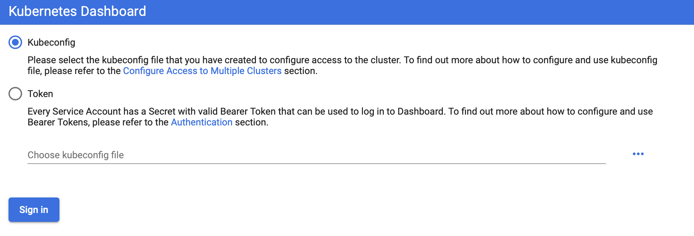
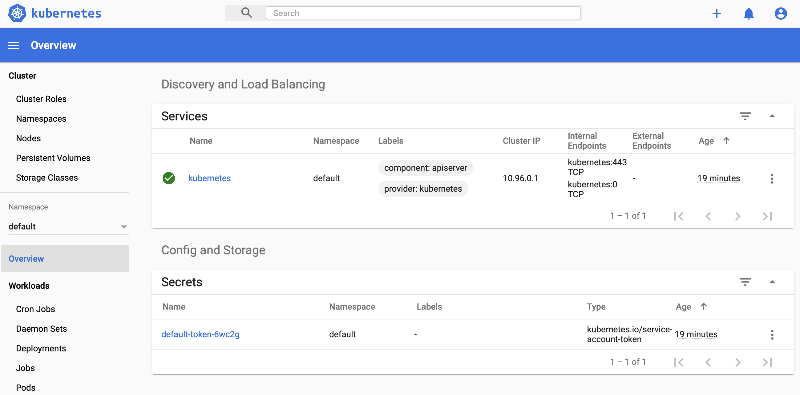

# Experiment with Prometheus on Azure Kubernetes Service (AKS)

Experimenting with prometheus and its ecosystem hosted on azure kubernetes service (aks).

This project shows how to run a prometheus server, connect it to grafana and add some services for scraping metrics.

The software in this project is highly experimental. Its only purpose is for me to learn about
* prometheus and grafana features,
* integrating them into a kubernetes environment
* which is hosted on azure
* and deployed using terraform.

## Usage

### Create a Kubernetes Cluster in Azure

1. Create the base infrastructure as described in section "... With Azure CLI Support" of [boos/terraform](https://hub.docker.com/repository/docker/boos/terraform)

```sh
# Pass your Login Credentials to the Azure CLI and to Terraform
echo -n "Azure client id: " && read -s ARM_CLIENT_ID && echo
echo -n "Azure client secret: " && read -s ARM_CLIENT_SECRET && echo
echo -n "Azure subscription id: " && read -s ARM_SUBSCRIPTION_ID && echo
echo -n "Azure tenant id: " && read -s ARM_TENANT_ID && echo

export ARM_CLIENT_ID
export ARM_CLIENT_SECRET
export ARM_SUBSCRIPTION_ID
export ARM_TENANT_ID
export TF_VAR_client_id=$ARM_CLIENT_ID
export TF_VAR_client_secret=$ARM_CLIENT_SECRET

echo
echo "      ARM_CLIENT_ID = $ARM_CLIENT_ID"
if [ -z "$ARM_CLIENT_SECRET" ]; then
    echo "  ARM_CLIENT_SECRET is empty"
else
    echo "  ARM_CLIENT_SECRET = <not printed here>"
fi
echo "ARM_SUBSCRIPTION_ID = $ARM_SUBSCRIPTION_ID"
echo "      ARM_TENANT_ID = $ARM_TENANT_ID"

# Launch the Terraform docker container
docker run -it --rm --name terra \
           -e "ARM_CLIENT_ID=$ARM_CLIENT_ID" \
           -e "ARM_SUBSCRIPTION_ID=$ARM_SUBSCRIPTION_ID" \
           -e "ARM_TENANT_ID=$ARM_TENANT_ID" \
           -e "ARM_CLIENT_SECRET=$ARM_CLIENT_SECRET" \
           -e "TF_VAR_client_id=$TF_VAR_client_id" \
           -e "TF_VAR_client_secret=$TF_VAR_client_secret" \
           -v /Users/stefan/src/experiment-with-prometheus-k8s:/root/work \
           boos/terraform

# To apply a modified configuration of the infrastructure quickly, execute
# the following commands in the boos/terraform docker container
cd /root/work/infrastructure

# If this is the first time you run terraform in this directory
# then initialize the terraform state
terraform init

# Create or update the k8s infrastructure in azure
terraform apply -auto-approve
```

2. Export the infrastructure configuration from the terraform state into environment variables of the docker container

```sh
export TF_VAR_k8s_host=$(terraform output host) \
  && export TF_VAR_k8s_username=$(terraform output username) \
  && export TF_VAR_k8s_password=$(terraform output password) \
  && export TF_VAR_k8s_client_certificate=$(terraform output client_certificate) \
  && export TF_VAR_k8s_client_key=$(terraform output client_key) \
  && export TF_VAR_k8s_cluster_ca_certificate=$(terraform output cluster_ca_certificate); \
  echo; \
  echo "                  Host = ${TF_VAR_k8s_host}"; \
  echo "              Username = ${TF_VAR_k8s_username}" ; \
  if [ -z "$TF_VAR_k8s_password" ]; then \
    echo "              Password is empty"; \
  else \
    echo "              Password won't be printed here"; \
  fi; \
  if [ -z "$TF_VAR_k8s_client_certificate" ]; then \
    echo "    Client certificate is empty"; \
  else \
    echo "    Client certificate won't be printed here"; \
  fi; \
  if [ -z "$TF_VAR_k8s_client_key" ]; then \
    echo "            Client key is empty"; \
  else \
    echo "            Client key won't be printed here"; \
  fi; \
  if [ -z "$TF_VAR_k8s_cluster_ca_certificate" ]; then \
    echo "Cluster CA certificate is empty"; \
  else \
    echo "Cluster CA certificate won't be printed here"; \
  fi
```

### Alternative to Azure: Use Docker Desktop Kubernetes

```sh
docker run -it --rm --name terra \
           -v /Users/stefan/.kube:/root/.kube \
           -v /Users/stefan/src/experiment-with-prometheus-k8s:/root/work \
           boos/terraform
```

### Create Services on Kubernetes

```sh
cd /root/work/monitoring

# If running a Kubernetes Cluster on Docker Desktop locally
cp k8s-and-helm-docker-desktop k8s-and-helm.tf

# If running a Kubernetes Cluster on Azure
cp k8s-and-helm-azure k8s-and-helm.tf

# If this is the first time you run terraform in this directory
# then initialize the terraform state
terraform init

# Create or update the service in kubernetes
terraform apply -auto-approve
```

## Inspect the Infrastructure

### Azure: Access the Kubernetes Dashboard

Follow the instructions on [Azure Portal](https://portal.azure.com) &rarr; Resource groups &rarr; k8srg &rarr; k8s_prod &rarr; View kubernetes dashboard:

```sh
# Execute the following commands directly on your local machine,
# outside the boos/terraform docker container

# If you have not installed azure aks yet, then run the following command
az aks install-cli

# Log into the k8s cluster and forward the dashboard to
# http://localhost:8001
az aks get-credentials --resource-group k8srg --name k8s_prod
az aks browse --resource-group k8srg --name k8s_prod
```

### Docker Desktop Kubernetes: Install Kubernetes Dashboard

Setting up the Kubernetes Dashboard is described in [5 Minutes to Kubernetes Dashboard running on Docker Desktop for Windows 2.0.0.3](http://collabnix.com/kubernetes-dashboard-on-docker-desktop-for-windows-2-0-0-3-in-2-minutes/). The procedure also works on macOS Catalina.

In short:

```sh
# Install the dashboard according to https://github.com/kubernetes/dashboard
kubectl apply -f https://raw.githubusercontent.com/kubernetes/dashboard/v2.0.0-rc2/aio/deploy/recommended.yaml

# Forward the dashboard to localhost
kubectl proxy
```

&rarr; Open the dashboard: http://localhost:8001/api/v1/namespaces/kubernetes-dashboard/services/https:kubernetes-dashboard:/proxy/



Next, set the credentials for the docker-[for-]desktop user

**On Windows**

```powershell
# Execute the following steps in PowerShell
$TOKEN=((kubectl -n kube-system describe secret default | Select-String "token:") -split " +")[1]
kubectl config set-credentials docker-for-desktop --token="${TOKEN}"
```

**On macOS / Linux**

```sh
TOKEN=$(kubectl -n kube-system describe secret default | grep '^token' | sed 's/token\:\ *//')
kubectl config set-credentials docker-desktop --token="$TOKEN"
```

Finally, select `Kubeconfig` in the login screen, click `Choose kubeconfig file` and select the file `.kube/config` in your home directory. On macOS you may need to press `Cmd+Shift+.` in order to show hidden directories in the open file dialog.



## Access Prometheus and Grafana

Once the system is running you can...

* To view Prometheus on http://localhost:9090/ forward its port by `kubectl port-forward -n monitoring  prometheus-prometheus-operator-prometheus-0 9090:9090`
* To view Grafana on http://localhost:3000/ forward its port by `kubectl port-forward -n monitoring prometheus-operator-grafana-5656685f99-wzrtc 3000:3000`. You can find out the pod name, the user name and the password in the kubernetes dashboard.

## Cleanup and Destroy the Infrastructure

### Destroy the Deployment Inside Kubernetes

```sh
cd /root/work/monitoring

terraform destroy -auto-approve
```

### Azure: Destroy the Kubernetes Cluster Itself

```sh
cd /root/work/infrastructure

terraform destroy -auto-approve
```

## Remarks and Tools

### Debug the prometheus.yaml Configuration Used by the Prometheus-Operator

The prometheus pod can be identified in the kubernetes dashboard by its name `prometheus-prom-operator-prometheus-o-prometheus-0`. When it is started, the prometheus configuration taken from the kubernetes secret `prometheus-prom-operator-prometheus-o-prometheus`. The secret contains the final prometheus configuration after `helm` has interpolated all its commandline arguments and parameter files. To inspect this final configuration, get the secret, decode it from base64 and then unzip it:

```sh
kubectl get secret prometheus-prom-operator-prometheus-o-prometheus -o yaml | grep prometheus.yaml.gz | awk '{print $2}' | base64 --decode | gzip -dc > actual_prometheus.yaml
```

## Next Steps

### Have prometheus scrape the blackbox exporter endpoint

### Establish Security

* [Securing your Helm Installation](https://v2.helm.sh/docs/using_helm/#securing-your-helm-installation)

### Resolve Code Smells

* Set resource constraints in the kubernetes pod configurations (min/max values, pod restart rules)

## References

### Primary Inspriation

* Hasham Haider: [Kubernetes in Production: The Ultimate Guide to Monitoring Resource Metrics with Prometheus](https://www.replex.io/blog/kubernetes-in-production-the-ultimate-guide-to-monitoring-resource-metrics), last visited on Jan. 23, 2020

### Terraform Practices

* HashiCorp: [Getting Started with Kubernetes provider](https://www.terraform.io/docs/providers/kubernetes/guides/getting-started.html), last visited on Jan. 21, 2020
* HashiCorp: [Terraform Recommended Practices - Part 1: An Overview of Our Recommended Workflow](https://www.terraform.io/docs/cloud/guides/recommended-practices/part1.html), last visited on Jan. 22, 2020
* HashiCorp: [Using the Kubernetes and Helm Providers with Terraform 0.12](https://www.hashicorp.com/blog/using-the-kubernetes-and-helm-providers-with-terraform-0-12/), last visited on Jan. 23, 2020

### Cloud Provider Specific Instructions

* Microsoft: [Create your Azure free account today](https://azure.microsoft.com/en-us/free/), last visited on Jan. 21, 2020
* Microsoft: [Tutorial: Create a Kubernetes cluster with Azure Kubernetes Service using Terraform](https://docs.microsoft.com/de-de/azure/terraform/terraform-create-k8s-cluster-with-tf-and-aks), last visited on Jan. 21, 2020
* HashiCorp: [Creating a Kubernetes Cluster with AKS and Terraform](https://www.hashicorp.com/blog/kubernetes-cluster-with-aks-and-terraform/), last visited on Jan. 21, 2020
* HashiCorp: [Azure Provider: Authenticating using a Service Principal with a Client Secret](https://www.terraform.io/docs/providers/azurerm/guides/service_principal_client_secret.html), last visited on Jan. 21, 2020.
* Microsoft: [Tutorial: Scale applications in Azure Kubernetes Service (AKS)](https://docs.microsoft.com/de-de/azure/aks/tutorial-kubernetes-scale), last visited on Jan. 23, 2020

### Prometheus and Grafana

* The Prometheus Authors: [Prometheus - Monitoring system & time series database](https://prometheus.io), last visited on Jan. 21, 2020
* The Prometheus Authors: [prometheus/blackbox_exporter](https://github.com/prometheus/blackbox_exporter), last visited on Jan. 21, 2020
* Joshua Barrat: [jbarratt/prometheus_sitemon](https://github.com/jbarratt/prometheus_sitemon), last visited on Jan. 21, 2020
* Grafana Labs: [Grafana: The open observability platform](https://grafana.com), last visited on Jan. 21, 2020

### Other Stuff

* Ajeet Singh Raina: [5 Minutes to Kubernetes Dashboard running on Docker Desktop for Windows 2.0.0.3](http://collabnix.com/kubernetes-dashboard-on-docker-desktop-for-windows-2-0-0-3-in-2-minutes/), last visited on Jan. 30, 2020
* The Kubernetes Dashboard Authors: [kubernetes/dashboard: General-purpose web UI for Kubernetes clusters](https://github.com/kubernetes/dashboard), last visited on Jan. 30, 2020
* The Kubernetes Authors: [Resource metrics pipeline - Kubernetes](https://kubernetes.io/docs/tasks/debug-application-cluster/resource-metrics-pipeline/), last visited on Jan. 23, 2020
* Stefan Boos: [boos/terraform](https://hub.docker.com/repository/docker/boos/terraform), last visited on Jan. 21, 2020
