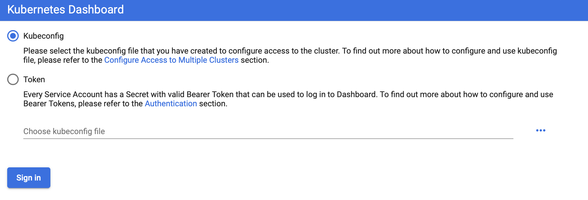
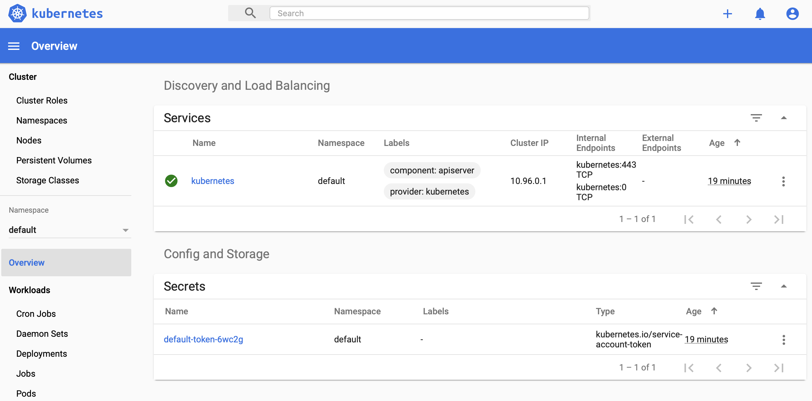

# Prepare a Kubernetes Cluster in Docker Desktop

## Prerequisite

Ensure that you have installed Docker Desktop and Kubernetes is running. You can double check this in the Docker Desktop Tray or in the Docker Desktop Preferences Pane:


## Install Kubernetes Dashboard

Setting up the Kubernetes Dashboard is described in [5 Minutes to Kubernetes Dashboard running on Docker Desktop for Windows 2.0.0.3](http://collabnix.com/kubernetes-dashboard-on-docker-desktop-for-windows-2-0-0-3-in-2-minutes/). The procedure also works on macOS Catalina.

In short:

```sh
# Install the dashboard according to https://github.com/kubernetes/dashboard
kubectl apply -f https://raw.githubusercontent.com/kubernetes/dashboard/v2.0.0-rc2/aio/deploy/recommended.yaml

# Forward the dashboard to localhost
kubectl proxy
```

&rarr; Open the dashboard: http://localhost:8001/api/v1/namespaces/kubernetes-dashboard/services/https:kubernetes-dashboard:/proxy/



Next, set the credentials for the docker-for-desktop user

**On Windows**

```powershell
# Execute the following steps in PowerShell
$TOKEN=((kubectl -n kube-system describe secret default | Select-String "token:") -split " +")[1]
kubectl config set-credentials docker-for-desktop --token="${TOKEN}"
```

**On macOS / Linux**

```sh
TOKEN=$(kubectl -n kube-system describe secret default | grep '^token' | sed 's/token\:\ *//')
kubectl config set-credentials docker-desktop --token="$TOKEN"
```

Finally, select `Kubeconfig` in the login screen, click `Choose kubeconfig file` and select the file `.kube/config` in your home directory. On macOS you may need to press `Cmd+Shift+.` in order to show hidden directories in the open file dialog.



## Prepare Terraform

Finally, launch the terraform docker container connected to your local kubernetes configuration.

```sh
docker run -it --rm --name terra \
           -v /Users/stefan/.kube:/root/.kube \
           -v /Users/stefan/src/experiment-with-prometheus-k8s:/root/work \
           boos/terraform
```

Using the terraform container you can setup the monitoring system in your local kubernetes cluster.